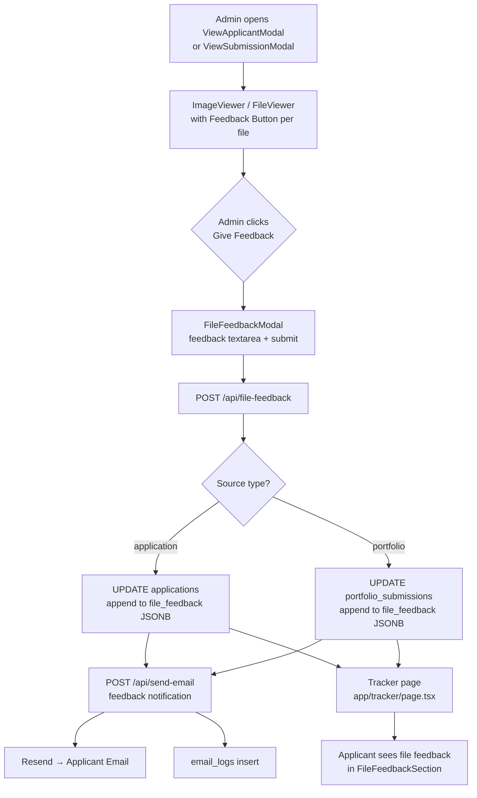
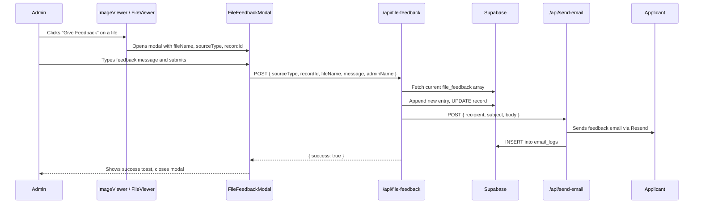
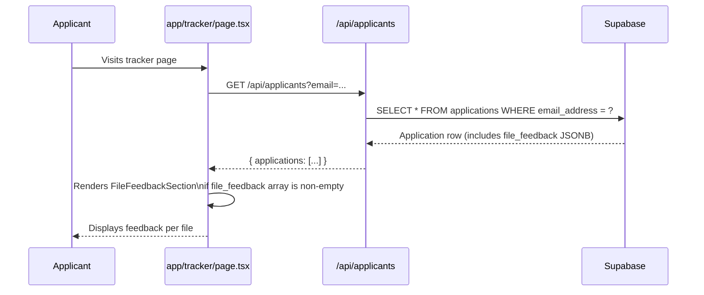

# Design Document: File Feedback

## Overview

This feature allows admins to submit targeted feedback on a specific file while viewing an applicant's documents inside the `ViewApplicantModal` (applicantsmanage.tsx) or `ViewSubmissionModal` (portfoliosubmissions.tsx). When feedback is submitted, two things happen: the applicant receives an email notification containing the feedback message, and the feedback is persisted to the database so it appears on the applicant's tracker page (`app/tracker/page.tsx`).

The feature builds entirely on existing infrastructure: the `/api/send-email` route (Resend), the `applications` and `portfolio_submissions` Supabase tables, the `admin_remarks` field already rendered on the tracker, and the `ImageViewer`/`FileViewer` components already embedded in both modals.

---

## Architecture



**Key architectural decisions:**

- Feedback is stored as a JSONB array column `file_feedback` on both `applications` and `portfolio_submissions` tables. Each entry records the file name, feedback message, admin name, and timestamp. This keeps feedback co-located with the record it belongs to and avoids a new join table.
- A single new API route `/api/file-feedback` handles both application and portfolio feedback, distinguished by a `sourceType` field in the request body.
- The `ImageViewer` and `FileViewer` components receive an optional `onFeedback` callback prop. When provided, a "Give Feedback" button appears per file. This keeps the viewer components generic and backward-compatible — existing usages without the prop are unaffected.
- Email sending reuses the existing `/api/send-email` route and `sendStatusEmail` pattern, keeping logging consistent.
- The tracker page renders a new `FileFeedbackSection` component that reads the `file_feedback` array from the application record. No new API endpoint is needed for the tracker — the existing `/api/applicants` fetch already returns the full application row.

---

## Sequence Diagrams

### Admin Submits File Feedback



### Applicant Views Feedback on Tracker



---

## Components and Interfaces

### 1. `file_feedback` JSONB Column (Database)

New column added to both `applications` and `portfolio_submissions` tables.

```sql
ALTER TABLE applications
  ADD COLUMN IF NOT EXISTS file_feedback JSONB DEFAULT '[]'::jsonb;

ALTER TABLE portfolio_submissions
  ADD COLUMN IF NOT EXISTS file_feedback JSONB DEFAULT '[]'::jsonb;
```

Each entry in the array follows this shape:

```typescript
interface FileFeedbackEntry {
  fileName: string;       // Display name of the file (e.g. "Tertiary: UP Diliman")
  message: string;        // Admin's feedback text
  adminName: string;      // Admin's display name or "Admin"
  createdAt: string;      // ISO 8601 timestamp
}
```

### 2. `/api/file-feedback` Route

**File:** `app/api/file-feedback/route.ts`

**Purpose:** Appends a feedback entry to the target record and triggers the feedback email.

**Interface:**

```typescript
// POST request body
interface FileFeedbackRequest {
  sourceType: 'application' | 'portfolio';
  recordId: string;           // application_id (uuid) or portfolio id (number as string)
  fileName: string;           // Human-readable file label shown in the viewer
  message: string;            // Feedback text (non-empty, max 2000 chars)
  adminName: string;          // Admin's display name for the email
}

// POST response body (success)
interface FileFeedbackResponse {
  success: true;
  entry: FileFeedbackEntry;
}

// POST response body (error)
interface FileFeedbackErrorResponse {
  error: string;
}
```

**Responsibilities:**
- Validate all required fields; return 400 if missing or invalid.
- Use the Supabase service-role client to fetch the current `file_feedback` array.
- Append the new `FileFeedbackEntry` and update the record.
- Fetch the applicant's email address from the same record.
- Call `/api/send-email` with a feedback-specific subject and body.
- Return the created entry on success.

### 3. `FileFeedbackModal` Component

**File:** `components/admin/FileFeedbackModal.tsx`

**Purpose:** A focused modal that collects the admin's feedback message for a specific file.

```typescript
interface FileFeedbackModalProps {
  isOpen: boolean;
  onClose: () => void;
  fileName: string;
  sourceType: 'application' | 'portfolio';
  recordId: string;
  adminName: string;
  onSuccess: (entry: FileFeedbackEntry) => void;
}
```

**Responsibilities:**
- Render a textarea for the feedback message (max 2000 characters, character counter shown).
- Show the target file name prominently so the admin confirms they're targeting the right file.
- On submit: call `POST /api/file-feedback`, show a loading state, then call `onSuccess` or display an inline error.
- Accessible: focus trap, ESC to close, ARIA labels.

### 4. `ImageViewer` Component (modified)

**File:** `components/admin/ImageViewer.tsx`

**New optional prop:**

```typescript
interface ImageViewerProps {
  // ... existing props ...
  onFeedback?: (imageUrl: string, imageName: string) => void;
}
```

When `onFeedback` is provided, a "Give Feedback" button (with a `MessageSquare` icon) appears in the toolbar next to the Download button. Clicking it calls `onFeedback(currentImageUrl, currentImageName)`.

### 5. `FileViewer` Component (modified)

**File:** `components/admin/FileViewer.tsx`

**New optional prop:**

```typescript
interface FileViewerProps {
  // ... existing props ...
  onFeedback?: (fileUrl: string, fileName: string) => void;
}
```

When `onFeedback` is provided, a "Give Feedback" button appears in the file info bar at the bottom of the preview area. Clicking it calls `onFeedback(selectedFile.url, selectedFile.name)`.

### 6. `ViewApplicantModal` (modified)

**File:** `app/admin/dashboard/applicantsmanage.tsx`

**Changes:**
- Add `feedbackModal` state: `{ fileName: string; fileUrl: string } | null`.
- Pass `onFeedback` to both `ImageViewer` and `FileViewer` that sets `feedbackModal`.
- Render `FileFeedbackModal` when `feedbackModal` is non-null.
- On `onSuccess`: update the local `applicant` state to include the new feedback entry (so the left sidebar can optionally show it without a full refetch).

### 7. `ViewSubmissionModal` (modified)

**File:** `app/admin/dashboard/portfoliosubmissions.tsx`

**Changes:** Same pattern as `ViewApplicantModal` above, using `sourceType: 'portfolio'` and the submission's `id`.

### 8. `FileFeedbackSection` Component (new, used in tracker)

**File:** `app/tracker/page.tsx` (inline component or extracted)

**Purpose:** Renders the list of file feedback entries on the applicant's tracker page.

```typescript
interface FileFeedbackSectionProps {
  feedback: FileFeedbackEntry[];
}
```

**Responsibilities:**
- Render each entry as a card showing: file name, feedback message, admin name, and formatted date.
- Use a distinct visual style (e.g., amber/orange border) to differentiate from the existing `admin_remarks` block.
- Show a section header "File Feedback from Admin" with a `Paperclip` or `FileWarning` icon.
- Hidden when `feedback` array is empty.

### 9. `Application` interface (tracker, modified)

**File:** `app/tracker/page.tsx`

Add `file_feedback` to the existing `Application` interface:

```typescript
interface Application {
  // ... existing fields ...
  file_feedback: FileFeedbackEntry[] | null;
}
```

---

## Data Models

### `FileFeedbackEntry` (shared type)

```typescript
interface FileFeedbackEntry {
  fileName: string;    // e.g. "Tertiary: UP Diliman — BS Computer Science"
  message: string;     // Admin's feedback text, 1–2000 characters
  adminName: string;   // e.g. "Admin" or admin's display name
  createdAt: string;   // ISO 8601, e.g. "2025-01-15T10:30:00.000Z"
}
```

### `applications` table (modified)

| Column | Type | Notes |
|---|---|---|
| `file_feedback` | `jsonb` | Default `'[]'`, array of `FileFeedbackEntry` objects |

### `portfolio_submissions` table (modified)

| Column | Type | Notes |
|---|---|---|
| `file_feedback` | `jsonb` | Default `'[]'`, array of `FileFeedbackEntry` objects |

### `/api/file-feedback` Request/Response

```typescript
// POST /api/file-feedback
// Request
{
  sourceType: 'application' | 'portfolio';
  recordId: string;
  fileName: string;       // max 500 chars
  message: string;        // 1–2000 chars
  adminName: string;      // max 200 chars
}

// Response 200
{
  success: true;
  entry: FileFeedbackEntry;
}

// Response 400
{ error: "message field is required and must be non-empty" }

// Response 404
{ error: "Record not found" }

// Response 500
{ error: "Failed to update record" }
```

---

## Algorithmic Pseudocode

### Main Feedback Submission Algorithm (`/api/file-feedback`)

```pascal
PROCEDURE handleFileFeedbackPost(request)
  INPUT: HTTP POST request with JSON body
  OUTPUT: HTTP response

  SEQUENCE
    body ← parseJSON(request.body)

    // Validate inputs
    IF body.sourceType NOT IN ['application', 'portfolio'] THEN
      RETURN HTTP 400 { error: "Invalid sourceType" }
    END IF
    IF body.recordId IS EMPTY THEN
      RETURN HTTP 400 { error: "recordId is required" }
    END IF
    IF body.message IS EMPTY OR length(body.message) > 2000 THEN
      RETURN HTTP 400 { error: "message must be 1–2000 characters" }
    END IF
    IF body.fileName IS EMPTY THEN
      RETURN HTTP 400 { error: "fileName is required" }
    END IF

    // Determine table and id column
    IF body.sourceType = 'application' THEN
      table ← 'applications'
      idColumn ← 'application_id'
      emailColumn ← 'email_address'
      nameColumn ← 'applicant_name'
    ELSE
      table ← 'portfolio_submissions'
      idColumn ← 'id'
      emailColumn ← null  // portfolio_submissions has no email; fetch from linked application
      nameColumn ← 'full_name'
    END IF

    // Fetch current record
    record ← supabase.from(table).select('*').eq(idColumn, body.recordId).single()
    IF record IS NULL THEN
      RETURN HTTP 404 { error: "Record not found" }
    END IF

    // Build new feedback entry
    newEntry ← {
      fileName: body.fileName,
      message: body.message,
      adminName: body.adminName OR 'Admin',
      createdAt: now().toISOString()
    }

    // Append to existing array
    existingFeedback ← record.file_feedback OR []
    updatedFeedback ← [...existingFeedback, newEntry]

    // Persist update
    updateResult ← supabase.from(table).update({ file_feedback: updatedFeedback }).eq(idColumn, body.recordId)
    IF updateResult.error IS NOT NULL THEN
      RETURN HTTP 500 { error: "Failed to update record" }
    END IF

    // Resolve applicant email
    IF body.sourceType = 'application' THEN
      applicantEmail ← record.email_address
      applicantName ← record.applicant_name
    ELSE
      // Fetch linked application for email
      appRecord ← supabase.from('applications').select('email_address, applicant_name').eq('user_id', record.user_id).single()
      applicantEmail ← appRecord?.email_address OR null
      applicantName ← record.full_name
    END IF

    // Send email (non-blocking — failure does not revert the update)
    IF applicantEmail IS NOT NULL THEN
      emailBody ← buildFeedbackEmailBody(applicantName, body.fileName, body.message)
      POST /api/send-email { recipient: applicantEmail, subject: "File Feedback – TIP ETEEAP", body: emailBody }
    END IF

    RETURN HTTP 200 { success: true, entry: newEntry }
  END SEQUENCE
END PROCEDURE
```

**Preconditions:**
- `sourceType` is `'application'` or `'portfolio'`
- `recordId` is a non-empty string matching an existing record
- `message` is a non-empty string of at most 2000 characters
- `fileName` is a non-empty string

**Postconditions:**
- The target record's `file_feedback` array contains the new entry as its last element
- An email has been dispatched (or a failure logged) to the applicant's email address
- The response contains the created `FileFeedbackEntry`

**Loop Invariants:** N/A (no loops)

### Key Functions with Formal Specifications

#### `buildFeedbackEmailBody(applicantName, fileName, message)`

```typescript
function buildFeedbackEmailBody(
  applicantName: string | null,
  fileName: string,
  message: string
): string
```

**Preconditions:**
- `fileName` is non-empty
- `message` is non-empty

**Postconditions:**
- Returns a non-empty string
- The returned string contains `fileName` as a substring
- The returned string contains `message` as a substring
- The returned string contains `applicantName` (or "Applicant" if null) as a substring

#### `appendFeedbackEntry(existing, newEntry)`

```pascal
FUNCTION appendFeedbackEntry(existing, newEntry)
  INPUT: existing (array of FileFeedbackEntry, may be null/undefined)
         newEntry (FileFeedbackEntry)
  OUTPUT: updated array of FileFeedbackEntry

  SEQUENCE
    safeExisting ← existing OR []
    RETURN [...safeExisting, newEntry]
  END SEQUENCE
END FUNCTION
```

**Preconditions:**
- `newEntry.message` is non-empty
- `newEntry.fileName` is non-empty
- `newEntry.createdAt` is a valid ISO 8601 string

**Postconditions:**
- Result length = `length(existing OR []) + 1`
- `result[result.length - 1]` equals `newEntry`
- All entries from `existing` are preserved in their original order

#### `FileFeedbackModal` submit handler

```pascal
PROCEDURE handleSubmit(feedbackText, props)
  INPUT: feedbackText (string), props (FileFeedbackModalProps)
  OUTPUT: side effects (API call, onSuccess/error state)

  SEQUENCE
    IF feedbackText.trim() IS EMPTY THEN
      SET validationError ← "Feedback message cannot be empty"
      RETURN
    END IF

    SET isSubmitting ← true
    SET error ← null

    response ← POST /api/file-feedback {
      sourceType: props.sourceType,
      recordId: props.recordId,
      fileName: props.fileName,
      message: feedbackText.trim(),
      adminName: props.adminName
    }

    IF response.ok THEN
      props.onSuccess(response.entry)
      props.onClose()
    ELSE
      SET error ← response.error OR "Failed to submit feedback"
    END IF

    SET isSubmitting ← false
  END SEQUENCE
END PROCEDURE
```

**Preconditions:**
- `props.recordId` is non-empty
- `props.sourceType` is valid
- `props.fileName` is non-empty

**Postconditions:**
- If successful: `onSuccess` is called with the new entry, modal closes
- If failed: error message is displayed, modal remains open
- `isSubmitting` is always reset to `false` after the call

---

## Example Usage

### Wiring `onFeedback` in `ViewApplicantModal`

```typescript
// Inside ViewApplicantModal component
const [feedbackModal, setFeedbackModal] = useState<{
  fileName: string;
  fileUrl: string;
} | null>(null);

// Pass to ImageViewer
<ImageViewer
  images={imageViewerImages}
  initialIndex={imageViewerIndex}
  isOpen={imageViewerOpen}
  onClose={() => setImageViewerOpen(false)}
  title="Applicant Image Viewer"
  onFeedback={(url, name) => setFeedbackModal({ fileName: name, fileUrl: url })}
/>

// Pass to FileViewer
<FileViewer
  files={fileViewerFiles}
  isOpen={fileViewerOpen}
  onClose={() => setFileViewerOpen(false)}
  title="Applicant Files"
  onFeedback={(url, name) => setFeedbackModal({ fileName: name, fileUrl: url })}
/>

// Render FileFeedbackModal
{feedbackModal && (
  <FileFeedbackModal
    isOpen={true}
    onClose={() => setFeedbackModal(null)}
    fileName={feedbackModal.fileName}
    sourceType="application"
    recordId={applicant.application_id}
    adminName="Admin"
    onSuccess={(entry) => {
      // Optimistically update local state
      setSelectedApplicant(prev => prev ? {
        ...prev,
        file_feedback: [...(prev.file_feedback || []), entry]
      } : prev);
      setFeedbackModal(null);
    }}
  />
)}
```

### Tracker Page Rendering

```typescript
// Inside ProgressTracker component
{application.file_feedback && application.file_feedback.length > 0 && (
  <FileFeedbackSection feedback={application.file_feedback} />
)}
```

### `FileFeedbackSection` render output (conceptual)

```
┌─────────────────────────────────────────────────────┐
│ 📎 File Feedback from Admin                          │
├─────────────────────────────────────────────────────┤
│ File: Tertiary: UP Diliman — BS Computer Science     │
│ "Please upload a clearer copy of your TOR."          │
│ — Admin · Jan 15, 2025                               │
├─────────────────────────────────────────────────────┤
│ File: Work Experience: Acme Corp — Software Engineer │
│ "Certificate of employment must be notarized."       │
│ — Admin · Jan 16, 2025                               │
└─────────────────────────────────────────────────────┘
```

---

## Correctness Properties

*A property is a characteristic or behavior that should hold true across all valid executions of a system — essentially, a formal statement about what the system should do. Properties serve as the bridge between human-readable specifications and machine-verifiable correctness guarantees.*

### Property 1: Feedback entry is appended, not replaced

*For any* existing `file_feedback` array (including `null`, treated as `[]`) of length N and any valid new `FileFeedbackEntry`, after a successful append operation the resulting array SHALL have length N+1, all N original entries SHALL be preserved in their original order, and the new entry SHALL be the last element.

**Validates: Requirements 10.1, 10.2, 10.3, 1.3, 10.4**

### Property 2: Email is sent for every successful feedback submission

*For any* valid feedback submission where the applicant's email address is non-null, the Email_Service SHALL be called exactly once with the applicant's email as recipient and a subject containing "File Feedback".

**Validates: Requirements 3.1**

### Property 3: Email body contains all required fields

*For any* combination of applicant name (including null), file name, and feedback message, the email body constructed by `buildFeedbackEmailBody` SHALL contain the file name, the feedback message, and the applicant name (or the string `"Applicant"` when null) as substrings.

**Validates: Requirements 3.2**

### Property 4: Invalid message is rejected by the API

*For any* POST to `/api/file-feedback` where `message` is an empty string, a whitespace-only string, or a string whose length exceeds 2000 characters, the API_Route SHALL return HTTP 400 and SHALL NOT modify any database record.

**Validates: Requirements 2.4, 2.5**

### Property 5: Invalid sourceType is rejected

*For any* POST to `/api/file-feedback` where `sourceType` is any string other than `'application'` or `'portfolio'`, the API_Route SHALL return HTTP 400 and SHALL NOT modify any database record.

**Validates: Requirements 2.2**

### Property 6: FileFeedbackSection renders all entries with required fields

*For any* non-empty `file_feedback` array of length N, the `FileFeedbackSection` component SHALL render exactly N feedback cards, each card containing the corresponding `fileName`, `message`, `adminName`, and a formatted `createdAt` date, displayed in the same order as the input array (oldest first).

**Validates: Requirements 9.2, 9.4, 9.7**

### Property 7: onFeedback prop is backward-compatible

*For any* rendering of `ImageViewer` or `FileViewer` without the `onFeedback` prop, the component SHALL render without a "Give Feedback" button, producing output identical to its pre-feature behavior.

**Validates: Requirements 4.4, 5.4**

### Property 8: onFeedback is called with the correct file arguments

*For any* file displayed in `ImageViewer` (at any index) or selected in `FileViewer`, when the "Give Feedback" button is clicked, the `onFeedback` callback SHALL be called with that file's URL and name as arguments.

**Validates: Requirements 4.3, 5.3**

### Property 9: FileFeedbackModal rejects whitespace-only messages client-side

*For any* string composed entirely of whitespace characters entered as the feedback message in `FileFeedbackModal`, the component SHALL display an inline validation error and SHALL NOT call the API_Route.

**Validates: Requirements 6.3**

---

## Error Handling

| Scenario | Behavior |
|---|---|
| Admin submits empty feedback | `FileFeedbackModal` shows inline validation error; API call is not made |
| API returns 400 (validation) | `FileFeedbackModal` shows the error message inline; modal stays open |
| API returns 404 (record not found) | `FileFeedbackModal` shows "Record not found" error; modal stays open |
| API returns 500 (DB error) | `FileFeedbackModal` shows "Failed to submit feedback" error; modal stays open |
| Email send fails after DB update | Failure is logged to `email_logs` with status "Failed"; DB update is NOT reverted; admin sees success |
| Applicant email is null (portfolio) | Email step is skipped; feedback is still saved to DB; no error surfaced to admin |
| `file_feedback` column is null in DB | Treated as empty array `[]`; append proceeds normally |
| Portfolio submission has no linked application | Email is skipped; feedback is still saved; no error surfaced to admin |

---

## Testing Strategy

### Unit Tests

- `buildFeedbackEmailBody`: verify file name, message, and applicant name appear in output; verify "Applicant" fallback when name is null
- `appendFeedbackEntry`: verify length increases by 1; verify original entries preserved; verify new entry is last
- `FileFeedbackModal` validation: verify empty message shows error and blocks submission
- `FileFeedbackSection`: verify N entries render N cards; verify empty array renders nothing
- `ImageViewer` with `onFeedback`: verify button appears when prop is provided; verify button absent when prop is omitted
- `FileViewer` with `onFeedback`: same as above

### Property-Based Tests

Use **fast-check** (already recommended in the existing spec).

| Property | Test Description |
|---|---|
| Property 1 | Generate random arrays of feedback entries + new entry; verify append preserves all and adds one |
| Property 3 | Generate random name/fileName/message strings; verify all appear in email body |
| Property 5 | Generate empty/whitespace strings as message; verify API returns 400 |
| Property 6 | Generate strings of length > 2000; verify API returns 400 |
| Property 8 | Generate random FileFeedbackEntry arrays; verify FileFeedbackSection renders correct count |

Tag format:
```typescript
// Feature: file-feedback, Property 1: Feedback entry is appended, not replaced
```

### Integration Tests

- Submit feedback for an application file; verify `file_feedback` array in DB contains the new entry
- Submit feedback for a portfolio file; verify `file_feedback` array in `portfolio_submissions` contains the new entry
- Submit feedback with valid applicant email; verify `email_logs` has a "Sent" entry with subject containing "File Feedback"
- Applicant tracker page fetches application with `file_feedback`; verify `FileFeedbackSection` renders

---

## Performance Considerations

- The `file_feedback` JSONB column is read as part of the full application row already fetched by the tracker page — no additional query is needed.
- Feedback arrays are expected to be small (< 50 entries per record), so JSONB append performance is not a concern.
- The `FileFeedbackModal` makes a single POST request; no debouncing or caching is needed.

---

## Security Considerations

- The `/api/file-feedback` route uses the Supabase service-role client (consistent with `/api/update-status`) to bypass RLS for the update. The route itself must be called from an authenticated admin session — session validation should be added using `getServerSession` from NextAuth.
- `message` content is stored as plain text in JSONB and rendered with React (no `dangerouslySetInnerHTML`), so XSS is not a concern.
- `recordId` is validated against the database before any write — no blind updates.
- The `sourceType` field is validated against an allowlist (`['application', 'portfolio']`) before use in table selection.

---

## Dependencies

- **Supabase** — existing client; service-role key already used in `/api/update-status`
- **Resend / `/api/send-email`** — existing email infrastructure; no new dependencies
- **lucide-react** — `MessageSquare` or `FileWarning` icon for the feedback button and section header (already installed)
- **fast-check** — property-based testing (already recommended in existing spec)
- No new npm packages required
