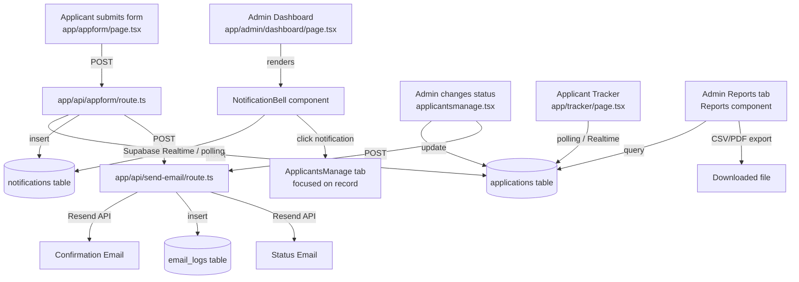

# Design Document: Notifications and Email Automation

## Overview

This feature adds two interconnected capabilities to the TIP ETEEAP system:

1. **Real-time in-app notifications** — a `NotificationBell` component in the admin dashboard header that shows a live count of unread notifications and a dropdown of recent applicant submissions, powered by Supabase Realtime with a polling fallback.
2. **Email automation** — confirmation emails on application submission and status-change emails when admins update applicant records, all routed through the existing Resend-based `app/api/send-email/route.ts` and logged to `email_logs`.

Additional scope includes: file upload validation in the application form, signature enforcement on final submission, admin remarks management, applicant tracker status polling, and a report generation page in the admin dashboard.

The design builds on existing infrastructure without replacing it. The `email_logs` table, `sendStatusEmail` helper, `EmailTemplate` component, and `SignatureCanvas` integration are all already partially in place — this design formalizes and completes them.

---

## Architecture



**Key architectural decisions:**

- Notifications are stored in Supabase (`notifications` table) so they persist across admin sessions and support the Realtime subscription model.
- The `NotificationBell` is a self-contained client component that manages its own subscription lifecycle, keeping the dashboard page clean.
- Email sending always goes through the existing `/api/send-email` route to ensure consistent logging to `email_logs`.
- File validation is a pure client-side utility function, keeping the form responsive without extra API round-trips.
- The elapsed time formatter is a pure utility function, making it independently testable.

---

## Components and Interfaces

### 1. `notifications` Supabase Table

New table required before any component work.

```sql
create table notifications (
  id            uuid primary key default gen_random_uuid(),
  type          text not null,                          -- e.g. "new_application"
  applicant_name text,
  application_id uuid references applications(application_id) on delete cascade,
  created_at    timestamptz not null default now(),
  is_read       boolean not null default false
);

-- RLS: admins can read/update all rows; service role can insert
alter table notifications enable row level security;
create policy "Admins can read notifications"
  on notifications for select
  using (auth.role() = 'authenticated');
create policy "Admins can update notifications"
  on notifications for update
  using (auth.role() = 'authenticated');
create policy "Service role can insert notifications"
  on notifications for insert
  with check (true);  -- enforced via service role key in API routes
```

### 2. `email_logs` Table (existing — confirmed schema)

The table is already used by `app/api/send-email/route.ts`. Confirmed columns:

| Column | Type | Notes |
|---|---|---|
| `id` | bigint (auto) | primary key |
| `recipient` | text | |
| `subject` | text | |
| `body` | text | |
| `status` | text | `'Sent'` or `'Failed'` |
| `sender` | text | |
| `error_details` | text | nullable |
| `created_at` | timestamptz | default now() |

No schema changes needed.

### 3. `NotificationBell` Component

**File:** `app/admin/dashboard/NotificationBell.tsx`

```typescript
interface Notification {
  id: string;
  type: string;
  applicant_name: string | null;
  application_id: string | null;
  created_at: string;
  is_read: boolean;
}

interface NotificationBellProps {
  onNavigateToApplicant: (applicationId: string) => void;
}
```

Responsibilities:
- Subscribe to `notifications` table via Supabase Realtime on mount; fall back to 30-second polling if subscription fails.
- Maintain local state: `notifications: Notification[]`, `isOpen: boolean`.
- Render bell icon (lucide `Bell`) with unread badge (capped at "99+").
- Render dropdown with up to 20 most recent notifications, ordered by `created_at` desc.
- On notification click: call `supabase.from('notifications').update({ is_read: true })`, then call `onNavigateToApplicant(application_id)`.
- On "Mark all as read": bulk update all `is_read = false` rows to `true`.
- Close dropdown on outside click via `useEffect` with `mousedown` listener.

### 4. `useNotifications` Hook

**File:** `app/admin/dashboard/useNotifications.ts`

```typescript
interface UseNotificationsReturn {
  notifications: Notification[];
  unreadCount: number;
  markAsRead: (id: string) => Promise<void>;
  markAllAsRead: () => Promise<void>;
  isLoading: boolean;
}

function useNotifications(): UseNotificationsReturn
```

Encapsulates the Supabase Realtime subscription and polling fallback. The `NotificationBell` component consumes this hook.

### 5. `formatElapsedTime` Utility

**File:** `lib/utils/formatElapsedTime.ts`

```typescript
function formatElapsedTime(createdAt: string): string
```

Rules:
- `< 60s` → `"just now"`
- `1–59 min` → `"X minute(s) ago"`
- `1–23 h` → `"X hour(s) ago"`
- `1–6 days` → `"X day(s) ago"`
- `≥ 7 days` → formatted date, e.g. `"Jan 5, 2025"`

Pure function with no side effects — takes an ISO timestamp string, returns a display string.

### 6. `validateFile` Utility

**File:** `lib/utils/validateFile.ts`

```typescript
interface FileValidationResult {
  valid: boolean;
  error: string | null; // null when valid
}

const ACCEPTED_MIME_TYPES = ['image/jpeg', 'image/png', 'image/gif', 'application/pdf'];
const MAX_FILE_SIZE_BYTES = 10 * 1024 * 1024; // 10 MB

function validateFile(file: File): FileValidationResult
```

Returns `{ valid: true, error: null }` on success, or `{ valid: false, error: "Invalid file type. Accepted: JPEG, PNG, GIF, PDF." }` / `{ valid: false, error: "File size exceeds 10 MB limit." }` on failure.

### 7. Notification Insertion in `app/api/appform/route.ts`

After a successful `applications` insert, the route inserts a notification:

```typescript
await supabase.from('notifications').insert({
  type: 'new_application',
  applicant_name: name,
  application_id: insertedApplicationId,
});
```

This uses the service role client already present in the route.

### 8. Reports Component

**File:** `app/admin/dashboard/reports.tsx`

Responsibilities:
- Query `applications` table for aggregate counts grouped by `status`, `campus`, `degree_applied_for`.
- Accept date range filter inputs (start date, end date).
- Render summary cards and a `recharts` bar chart (already in dependencies).
- "Export as CSV": generate CSV string client-side from filtered records, trigger download via `URL.createObjectURL`.
- "Export as PDF": use `window.print()` with a print-specific CSS class (consistent with existing `openPrintPreview` pattern).
- Show "No data available for the selected filters." and disable export buttons when filtered result is empty.

### 9. Applicant Tracker Realtime/Polling

**File:** `app/tracker/page.tsx` (modification)

Add a `useEffect` that sets up either:
- A Supabase Realtime subscription on the `applications` table filtered by `email_address = session.user.email`, or
- A 30-second polling interval as fallback.

This ensures status updates appear within 60 seconds without a manual refresh.

---

## Data Models

### `notifications` table

| Column | Type | Constraints |
|---|---|---|
| `id` | `uuid` | PK, default `gen_random_uuid()` |
| `type` | `text` | NOT NULL |
| `applicant_name` | `text` | nullable |
| `application_id` | `uuid` | FK → `applications.application_id`, ON DELETE CASCADE |
| `created_at` | `timestamptz` | NOT NULL, default `now()` |
| `is_read` | `boolean` | NOT NULL, default `false` |

### `applications` table (existing, relevant columns)

| Column | Type | Notes |
|---|---|---|
| `application_id` | `uuid` | PK |
| `status` | `text` | `'Submitted' \| 'Pending' \| 'Competency Process' \| 'Enrolled' \| 'Graduated'` |
| `admin_remarks` | `text` | nullable |
| `signature_url` | `text` | nullable, populated on submission |
| `email_address` | `text` | applicant email |
| `updated_at` | `timestamptz` | updated on status/remarks change |

### `email_logs` table (existing)

No changes. See confirmed schema in Components section above.

### Notification UI State (client-side)

```typescript
interface NotificationState {
  notifications: Notification[];   // up to 20 most recent
  unreadCount: number;             // count of is_read=false
  isOpen: boolean;                 // dropdown visibility
  isLoading: boolean;
}
```

---

## Correctness Properties

*A property is a characteristic or behavior that should hold true across all valid executions of a system — essentially, a formal statement about what the system should do. Properties serve as the bridge between human-readable specifications and machine-verifiable correctness guarantees.*

### Property 1: Email body contains all required applicant fields

*For any* applicant record with a non-null name, degree program, campus, and submission date, the confirmation email body constructed by the email service SHALL contain all four values as substrings.

**Validates: Requirements 1.3**

---

### Property 2: Email logging round-trip

*For any* valid email payload (recipient, subject, body), after calling the send-email endpoint, the `email_logs` table SHALL contain an entry with matching recipient, matching subject, and a status of either `"Sent"` or `"Failed"`.

**Validates: Requirements 1.5, 9.5**

---

### Property 3: Notification insertion on submission

*For any* successful application submission with a given applicant name and application ID, the `notifications` table SHALL contain a record with `type = "new_application"`, matching `applicant_name`, matching `application_id`, and `is_read = false`.

**Validates: Requirements 2.1**

---

### Property 4: Unread badge display

*For any* unread notification count N ≥ 0, the `NotificationBell` badge SHALL display `N` when `0 < N ≤ 99`, display `"99+"` when `N > 99`, and display no badge when `N = 0`.

**Validates: Requirements 3.2, 3.3**

---

### Property 5: Dropdown ordering and limit

*For any* collection of notifications, the dropdown SHALL display at most 20 items, and the items SHALL be ordered by `created_at` descending (newest first).

**Validates: Requirements 3.4**

---

### Property 6: Notification item renders all required fields

*For any* notification record with a non-null `applicant_name` and `created_at`, the rendered notification item SHALL contain the applicant name, a non-empty message string, and a non-empty elapsed time string.

**Validates: Requirements 4.1**

---

### Property 7: Elapsed time formatting correctness

*For any* ISO timestamp string, `formatElapsedTime` SHALL return:
- `"just now"` when the difference is less than 60 seconds
- `"X minute(s) ago"` when the difference is between 1 and 59 minutes
- `"X hour(s) ago"` when the difference is between 1 and 23 hours
- `"X day(s) ago"` when the difference is between 1 and 6 days
- A formatted date string (e.g. `"Jan 5, 2025"`) when the difference is 7 or more days

**Validates: Requirements 4.2**

---

### Property 8: Mark all as read sets all is_read to true

*For any* collection of notifications with mixed `is_read` states, after invoking `markAllAsRead`, every notification in the collection SHALL have `is_read = true`.

**Validates: Requirements 4.4**

---

### Property 9: File type validation accepts only allowed MIME types

*For any* file with a MIME type, `validateFile` SHALL return `valid = true` if and only if the MIME type is one of `image/jpeg`, `image/png`, `image/gif`, `application/pdf`; for all other MIME types it SHALL return `valid = false` with an error message mentioning "type".

**Validates: Requirements 5.1, 5.3**

---

### Property 10: File size validation enforces 10 MB limit

*For any* file size value in bytes, `validateFile` SHALL return `valid = true` when size ≤ 10,485,760 bytes (10 MB) and `valid = false` with an error message mentioning "size" when size > 10,485,760 bytes.

**Validates: Requirements 5.2, 5.3**

---

### Property 11: Signature clear is idempotent and resets to empty

*For any* drawn signature on the `SignaturePad`, after invoking `clearSignature`, `getSignature()` SHALL return `null` (canvas is empty), regardless of how many strokes were drawn.

**Validates: Requirements 6.5**

---

### Property 12: Remarks pre-population from admin_remarks

*For any* applicant record where `admin_remarks` is non-null, the remarks input field rendered in the Applicants Management tab SHALL have its value equal to `admin_remarks`.

**Validates: Requirements 7.1**

---

### Property 13: Remarks round-trip persistence

*For any* non-empty remarks string saved by an admin for an applicant, querying the `applications` table for that `application_id` SHALL return the same string in `admin_remarks`.

**Validates: Requirements 7.2, 7.3**

---

### Property 14: Status template mapping is total and non-empty

*For any* status value in `{"Submitted", "Pending", "Competency Process", "Enrolled", "Graduated"}`, `getRemarksTemplate(status)` SHALL return a non-empty string.

**Validates: Requirements 7.4**

---

### Property 15: Tracker status is always a valid enum value

*For any* application record fetched by the tracker page, the displayed status SHALL be one of `"Submitted"`, `"Pending"`, `"Competency Process"`, `"Enrolled"`, `"Graduated"`.

**Validates: Requirements 8.2**

---

### Property 16: Status email is sent for every notifiable status change

*For any* status change where the new status is one of `"Pending"`, `"Competency Process"`, `"Enrolled"`, `"Graduated"`, the email service SHALL be called with the applicant's email address and a subject specific to that status.

**Validates: Requirements 9.1, 9.2**

---

### Property 17: Status email body contains name, status, and remarks

*For any* combination of applicant name, new status, and admin remarks, the Status_Email body SHALL contain the applicant name, the new status string, and the remarks text as substrings.

**Validates: Requirements 9.3**

---

### Property 18: View Details auto-transitions Submitted → Pending

*For any* application with `status = "Submitted"`, after `handleViewDetails` is called, the application's status in the `applications` table SHALL be `"Pending"`.

**Validates: Requirements 11.2**

---

### Property 19: View Details does not change non-Submitted statuses

*For any* application with status in `{"Pending", "Competency Process", "Enrolled", "Graduated"}`, after `handleViewDetails` is called, the application's status SHALL remain unchanged.

**Validates: Requirements 11.3**

---

### Property 20: Report aggregation correctness

*For any* collection of application records, the report aggregation function SHALL return counts that, when summed across all groups, equal the total number of records in the input collection.

**Validates: Requirements 10.1**

---

### Property 21: Date range filter excludes out-of-range records

*For any* date range `[start, end]` and any collection of application records, the filtered result SHALL contain only records where `created_at` falls within `[start, end]` (inclusive), and SHALL exclude all records outside that range.

**Validates: Requirements 10.2**

---

### Property 22: CSV export contains all required columns for every record

*For any* collection of applicant records, the generated CSV string SHALL contain a header row with all required columns (`applicant_name`, `email_address`, `degree_applied_for`, `campus`, `status`, `created_at`, `admin_remarks`), and each data row SHALL contain the corresponding values from the applicant record.

**Validates: Requirements 10.3**

---

## Error Handling

| Scenario | Behavior |
|---|---|
| Resend API fails on confirmation email | Log `"Failed"` to `email_logs`; return 200 to applicant (non-blocking) |
| Resend API fails on status email | Log `"Failed"` to `email_logs`; do not revert status change |
| Notification insert fails | Log error to console; do not block application submission response |
| Supabase Realtime unavailable | `useNotifications` falls back to 30-second polling |
| File upload fails (photo/signature) | Return error to applicant; block submission; display inline error |
| File validation fails (type/size) | Display inline error adjacent to input; block next-step navigation |
| Empty signature on submit | Display "A signature is required to submit the application."; block submission |
| No applicant records match report filters | Display "No data available for the selected filters."; disable export buttons |
| Admin views applicant with no email | `sendStatusEmail` logs a warning and returns early; no crash |

---

## Testing Strategy

### Unit Tests

Focus on pure functions and isolated component behavior:

- `formatElapsedTime`: test each time bucket boundary (just now, minutes, hours, days, formatted date)
- `validateFile`: test accepted/rejected MIME types, boundary file sizes (exactly 10 MB, 10 MB + 1 byte)
- `getRemarksTemplate`: test each status returns a non-empty string
- `NotificationBell` badge rendering: test N=0 (no badge), N=1, N=99, N=100 ("99+")
- `FinalReviewStep`: test submit blocked when signature is empty, allowed when signature is drawn
- Reports aggregation function: test grouping and counting logic with known datasets
- CSV generation: test output contains correct headers and row values

### Property-Based Tests

Use a property-based testing library (recommended: **fast-check** for TypeScript) with minimum 100 iterations per property. Each test is tagged with the corresponding design property.

Install: `npm install --save-dev fast-check`

Properties to implement (referencing the Correctness Properties section above):

| Property | Test Description |
|---|---|
| Property 2 | Generate random email payloads; verify email_logs entry exists with matching fields |
| Property 4 | Generate random integers N ≥ 0; verify badge display logic |
| Property 5 | Generate random notification arrays; verify dropdown ordering and 20-item cap |
| Property 7 | Generate random timestamps in each time bucket; verify formatElapsedTime output |
| Property 8 | Generate random notification arrays with mixed is_read; verify markAllAsRead result |
| Property 9 | Generate random MIME type strings; verify validateFile accepts/rejects correctly |
| Property 10 | Generate random file sizes; verify validateFile size boundary |
| Property 11 | Generate random signature strokes; verify clearSignature resets to null |
| Property 13 | Generate random remarks strings; verify round-trip persistence |
| Property 14 | Enumerate all statuses; verify getRemarksTemplate returns non-empty |
| Property 15 | Generate random application records; verify status is always a valid enum value |
| Property 17 | Generate random name/status/remarks combinations; verify email body contains all |
| Property 20 | Generate random application collections; verify aggregation sum equals total count |
| Property 21 | Generate random date ranges and record sets; verify filter correctness |
| Property 22 | Generate random applicant record arrays; verify CSV structure |

Tag format for each property test:
```typescript
// Feature: notifications-and-email-automation, Property 7: Elapsed time formatting correctness
```

### Integration Tests

- Submit application form end-to-end; verify `email_logs` has a `"Sent"` entry and `notifications` has a new record.
- Update applicant status; verify `email_logs` has a status email entry.
- Admin opens "Submitted" application via View Details; verify status becomes "Pending" in DB.
- Applicant tracker reflects status change within 60 seconds after admin update.

### Smoke Tests

- Verify `notifications` table exists with all required columns.
- Verify `email_logs` table exists with all required columns.
- Verify Supabase Realtime channel can be subscribed to without error.
